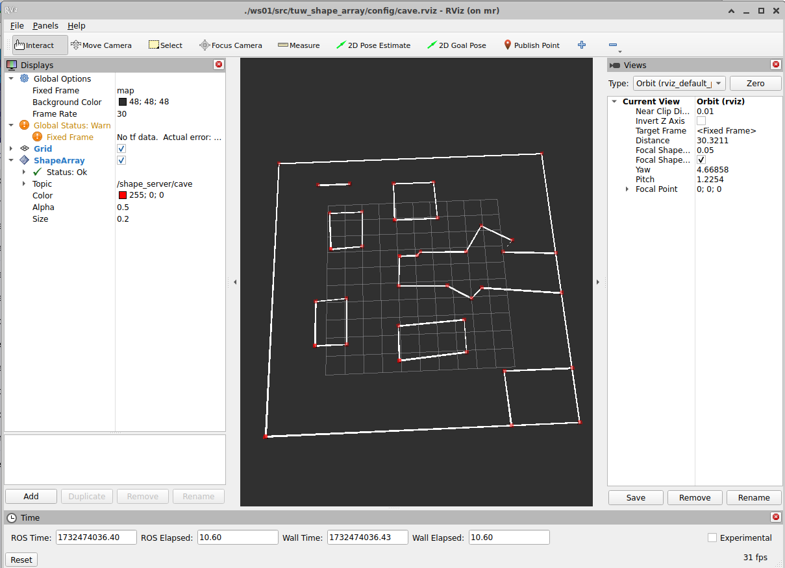

# tuw_object
This package holds nodes related to the [tuw_object_msgs](https://github.com/tuw-robotics/tuw_msgs/tree/ros2/tuw_object_msgs)

## [tuw_shape_array](tuw_shape_array/README.md)

 
<table style="width:400px;"><td>
tuw_shape_array_msg visualized with the tuw_rviz plugins in RViz2
</td></table> 

