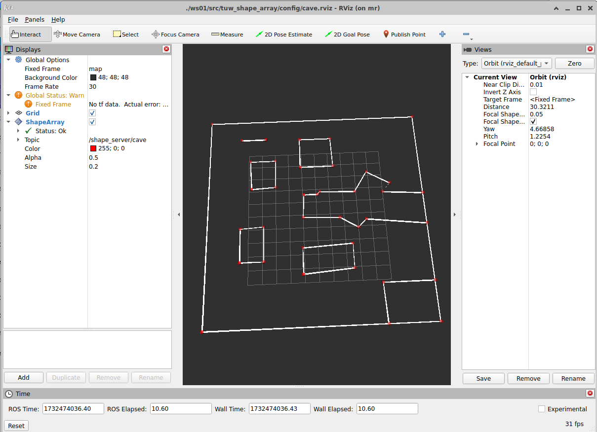

# tuw_shape_array
## shape_server_node
### Parameters
* __json__: 
  * json filename with the shape_array to open
* __frame_id__: 
  * can be used to replace the frame id
  * default: *false*
* __pub_interval__: 
  * publishing interval in seconds. If 0 or less, the graph is published once. [sec]
  * default: *10.0*
### Publisher
* __shapes__
  * Shapes from the json file
  * Type: *tuw_object_msgs::msg::ShapeArray*
### Subscriber
* __get__
  * Returns the shape_array on request
  * Type: *tuw_object_msgs::srv::GetShapeArray*
* __publish__
  * Request to publish the shape_array
  * Type: *std_srvs::srv::Trigger*

## Demo

```
# starts rvizs and a shape server
tmuxinator start -p ws02/src/tuw_object/tuw_shape_array/tmux/cave.yml
```
<div align="center">
<br>
<table style="width:400px;"><td>
tuw_shape_array_msg visualized with the tuw_rviz plugins in RViz2
</td></table> 
</div>

## transform_from_wgs84_node
Used to transform a shape array defined in GPS coordiantes to a map frame system with a user defined border.
How the WGS coordinates are coded in the shape_array is shown in the file [vineyard_straden.json](./config/vineyard_straden.json) can be seen
### Parameters
* __json__: 
  * json filename with the shape_array to open
* __frame_id__: 
  * can be used to replace the frame id
  * default: *false*
* __pub_interval__: 
  * publishing interval in seconds. If 0 or less, the graph is published once. [sec]
  * default: *10.0*
### Publisher
* __shapes__
  * Shapes from the json file
  * Type: *tuw_object_msgs::msg::ShapeArray*
### Subscriber
* __get__
  * Returns the shape_array on request
  * Type: *tuw_object_msgs::srv::GetShapeArray*
* __publish__
  * Request to publish the shape_array
  * Type: *std_srvs::srv::Trigger*

## Demo
```
# starts rvizs and a shape server with geo image and 
tmuxinator start -p ws02/src/tuw_object/tuw_shape_array/tmux/vineyard_straden.yml
```

<div align="center">
<br>
<table style="width:400px;"><td>
tuw_shape_array_msg visualized with the tuw_rviz plugins in RViz2
</td></table> 
</div>